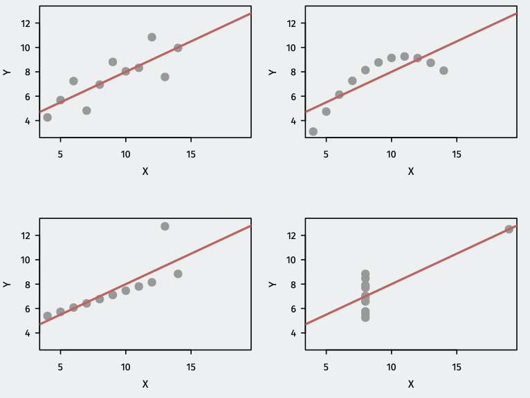

```{css,echo = F}
.small .remark-code { /*Change made here*/
  font-size: 85% !important;
}
.tiny .remark-code { /*Change made here*/
  font-size: 50% !important;
}
```

```{r,include=F}
set.seed(123)
options(width=60)
knitr::opts_chunk$set(fig.align='center',fig.width=9,fig.height=5,message=F,warning=F)
def.chunk.hook  <- knitr::knit_hooks$get("chunk")
knitr::knit_hooks$set(chunk = function(x, options) {
  x <- def.chunk.hook(x, options)
  ifelse(options$size != "normalsize", paste0("\n \\", options$size,"\n\n", x, "\n\n \\normalsize"), x)
})
```


---

# Presidential Popularity and the Midterms

```{r, echo=FALSE, out.width="95%",}
knitr::include_graphics("figs/trump_popularity.pdf")
```

---

# Presidential Popularity and the Midterms


  - Does popularity of the president or recent changes in the economy better predict midterm election outcomes? 
  
| Name           | Description |
|----------------|:------------------------------------------------------------------------------------------|
| `year`         |      midterm election year |
| `president`         |      name of president |
| `party`         |      Democrat or Republican |
| `approval`         |      Gallup approval rating at midterms |
| `rdi.change`         |      change in real disposable income over the year before midterms |
| `seat.change`         |     change in the number of House seats for the president’s party |
 
---

# Loading the data:

  
```{r, echo=FALSE}
setwd("~/Library/CloudStorage/Dropbox/Villanova/TEACHING/PSC4375 - QSS/PSC4375_S2025/PSC4375_S2025/lectures")
```
  
  
```{r}
library(tidyverse)
midterms <- read.csv("../data/midterms.csv")
head(midterms)
```

---

# Fitting the Approval Model
  
```{r}
fit.app <- lm(seat.change ~ approval, data = midterms)
fit.app
```
  
---

# Fitting the Income Model
  
```{r}
fit.rdi <- lm(seat.change ~ rdi.change, data = midterms)
fit.rdi
```
    
---

# Comparing Models


```{r, echo=FALSE, out.width='.49\\linewidth', fig.width=3, fig.height=3,fig.show='hold',fig.align='center'}
library(patchwork)
midterms %>%
  ggplot(aes(x=approval,y=seat.change)) +
  geom_point(shape = 21) + 
  geom_smooth(method='lm', color="red", se=F) +
  labs(x = "Presidential Approval",
       y = str_wrap("Change in President Party's No. of House Seats", width=35)) +
  theme_bw() 

midterms %>%
  ggplot(aes(x=rdi.change,y=seat.change)) +
  geom_point(shape = 21) + 
  geom_smooth(method='lm', color="red", se=F) +
  labs(x = "Change in Real Disposable Income",
       y = str_wrap("Change in President Party's No. of House Seats", width=35)) +
  theme_bw() 
```

\pause 
  - How well do the models "fit the data"? \pause 
    - How well does the model predict the outcome variable in the data?
    
---

# Model Fit

\pause

  - One number summary of model fit: $R^2$ or **coefficient of determination**.\pause
    - Measure of the **proportional reduction in error** by the model.\pause
  - Prediction error compared to what?\pause
    - Baseline prediction error: **Total sum of squares** 
      - TSS $= \sum_{i=1}^{n}(Y_i-\bar{Y})^2$\pause
    - Model prediction error: **Sum of squared residuals** 
      - SSR $= \sum_{i=1}^{n} \epsilon_i^2$\pause
    - TSS - SSR: reduction in prediction error by the model.\pause
  - $R^2$ is this reduction in error divided by the baseline error: \vspace{-3pt}
  
$$
R^2 = \frac{\text{TSS} - \text{SSR}}{\text{TSS}}
$$

\pause

  - Roughly: proportion of the variation in $Y_i$ "explained by" $X_i$
  
---

# Total sum of squares vs. Sum of squared residuals

```{r, echo=FALSE, fig.width=4.5, fig.height=3}
midterms <- midterms %>%
  mutate(mean_seatchange = mean(seat.change, na.rm=T))
  
midterms %>%
  ggplot(aes(x=approval,y=seat.change)) +
  geom_point(shape = 21) + 
  geom_hline(yintercept = midterms$mean_seatchange, color = "blue", size=1) + 
  geom_segment(aes(xend = approval, yend = mean_seatchange), color = "blue") +
  labs(x = "Presidential Approval",
       y = str_wrap("Change in President Party's No. of House Seats", width=35),
       title = "Deviations from the mean") +
  theme_bw()
```

---

# Total sum of squares vs. Sum of squared residuals

```{r, echo=FALSE, fig.width=4.5, fig.height=3}
midterms %>%
  filter(!is.na(seat.change)) %>%
  ggplot(aes(x=approval,y=seat.change)) +
  geom_point(shape = 21) + 
  geom_smooth(method='lm', color="red", se=F) + 
  geom_segment(aes(xend = approval, yend = predict(fit.app)), color = "red") +
  labs(x = "Presidential Approval",
       y = str_wrap("Change in President Party's No. of House Seats", width=35),
       title = "Residuals") +
  theme_bw()
```

---

# Model Fit in R

 - To access $R^2$ from the `lm()` output, use the `summary()` function:
 
```{r}
fit.app.sum <- summary(fit.app)
fit.app.sum$r.squared
```

\pause

 - Compare to fit using change in income:

```{r}
fit.rdi.sum <- summary(fit.rdi)
fit.rdi.sum$r.squared
``` 

\pause

  - Which does a better job predicting midterm election outcomes?
  
---

# Fake data, better fit

\pause

  - Little hard to see what’s happening in that example. \pause
  - Let’s look at fake variables x and y: \pause
  
```{r, echo=F}
set.seed(123)
# Create a dataset with a high correlation (R-squared approx. 0.95)
x <- rnorm(100)  # 100 random values for x
y <- 3 * x + rnorm(100, sd = 0.5)  # y is strongly linearly related to x with some noise
y_mean <- mean(y)
```

```{r}
fit.x <- lm(y ~ x)
```

  - Very good model fit: $R^2 \approx$ 0.95
  
---

# Fake data, better fit

```{r, echo=FALSE, fig.width=4.5, fig.height=3}
ggplot(data.frame(x, y), aes(x = x, y = y)) +
  geom_point(shape = 21) + 
  geom_hline(yintercept = y_mean, color = "red", size=1) + 
  labs(x = "x",
       y = "y") +
  theme_bw()
```

---

# Fake data, better fit

```{r, echo=FALSE, fig.width=4.5, fig.height=3}
ggplot(data.frame(x, y), aes(x = x, y = y)) +
  geom_point(shape = 21) + 
  geom_hline(yintercept = y_mean, color = "red", size=1) + 
  geom_segment(aes(xend = x, yend = y_mean), color = "black") +
  labs(x = "x",
       y = "y") +
  theme_bw()
```


---

# Fake data, better fit

```{r, echo=FALSE, fig.width=4.5, fig.height=3}
ggplot(data.frame(x, y), aes(x = x, y = y)) +
  geom_point(shape = 21) + 
  geom_smooth(method = "lm", se = FALSE, color = "red") + 
  geom_segment(aes(xend = x, yend = predict(fit.x)), color = "black") +
  labs(x = "x",
       y = "y") +
  theme_bw()
```

---

# Is R-squared useful?

  - Can be very misleading. Each of these samples have the same $R^2$ even though they are vastly different:
  
  
```{r, echo=FALSE, out.width="65%",}

```

---

# Overfitting

\pause

  - **In-sample fit**: how well your model predicts the data used to estimate it.\pause
    - $R^2$ is a measure of in-sample fit.\pause
  - **Out-of-sample fit**: how well your model predicts new data.\pause
  - **Overfitting**: OLS optimizes in-sample fit; may do poorly out of sample.\pause
    - Example: predicting winner of Democratic presidential primary with gender of the candidate.\pause
    - Until 2016, gender was a **perfect** predictor of who wins the primary.\pause
    - Prediction for 2016 based on this: Bernie Sanders as Dem. nominee.\pause
    - Bad out-of-sample prediction due to overfitting!
    
---

# Multiple Predictors (Multivariate Regression)

\pause

 - What if we want to predict $Y$ as a function of many variables? \pause
 
$$
\texttt{seat.change}_i = \alpha + \beta_1 \texttt{approval}_i + \beta_2 \texttt{rdi.change}_i + \epsilon_i
$$

\pause
  - Better predictions (at least in-sample).\pause
  - Better interpretation as ceteris paribus relationships:\pause
    - $\beta_1$ is the relationship between $\texttt{approval}$ and $\texttt{seat.change}$ holding
$\texttt{rdi.change}$ constant.

---

# Multiple regression in R

\pause

\footnotesize
```{r}
mult.fit <- lm(seat.change ~ approval + rdi.change, data = midterms)
mult.fit
```

\pause

  - $\hat{\alpha} = -120.4$: average seat change president has 0% approval and no change in income levels.\pause
  - $\hat{\beta_1} = 1.57$: average increase in seat change for additional percentage point of approval, **holding RDI change fixed**\pause
  - $\hat{\beta_1} = 3.334$: average increase in seat change for each additional percentage point increase of RDI, **holding approval fixed**

---

# Least squares with multiple regression

\pause

  - How do we estimate the coefficients?\pause
  - The same exact way as before: minimize prediction error!\pause
  - Residuals (aka prediction error) with multiple predictors:\pause
  
$$
\hat{\epsilon_i} = \texttt{seat.change}_i - \hat{\alpha} - \hat{\beta_1} \texttt{approval}_i - \hat{\beta_2} \texttt{rdi.change}_i
$$

\pause

  - Find the coefficients that minimizes the **sum of the squared residuals**:\pause

$$
\text{SSR} = \sum_{-=1}^{n}\hat{\epsilon_i^2} = (Y_i - \hat{\alpha} - \hat{\beta_1} X_{i1} - \hat{\beta_2} X_{i2})^2
$$
---

# Model fit with multiple predictors

\pause

  - $R^2$ mechanically increases when you add a variables to the regression.\pause
    - But this could be overfitting!!\pause
  - Solution: penalize regression models with more variables.\pause
    - Occam's razor: **simpler models are preferred**\pause
  - Adjusted $R^2$: lowers regular $R^2$ for each additional covariate.\pause
    - If the added covariates don’t help predict, adjusted $R^2$ goes down!
    
---

# Comparing Model Fits

```{r}
summary(fit.app)$r.squared
summary(mult.fit)$r.squared
summary(mult.fit)$adj.r.squared
```

---

# Binary and Categorical Predictors

```{r, echo=FALSE, out.width="35%",}

```

\pause

  - Political effects of government programs\pause
    - *Progesa*: Mexican conditional cash transfer program (CCT) from c. 2000\pause
      - Welfare $ given if kids enrolled in schools, get regular check-ups, etc.\pause
    - Do these programs have political effects?\pause
      - Program had support from most parties.\pause
      - Was implemented in a nonpartisan fashion.\pause
      - Would the incumbent presidential party be rewarded?
      
---      

# The Data

  - Randomized roll-out of the CCT program:
    - treatment: receive CCT 21 months before 2000 election
    - control: receive CCT 6 months before 2000 election
    - Does having CCT longer mobilize voters for incumbent PRI party?
    
| Name           | Description |
|----------------|:------------------------------------------------------------------------------------------|
| `treatment`         |      early Progresa (1) or late Progresa (0) |
| `pri2000s`         |      PRI votes in the 2000 election as a share of adults in precinct |
| `t2000`         |      turnout in the 2000 election as share of adults in precinct |

```{r}
cct <- read.csv("../data/progresa.csv")
```

---

# Difference in Means Estimates

\footnotesize  
  - Does CCT affect turnout?

```{r}
cct.turn.ate <- cct %>% group_by(treatment) %>%
  summarize(t2000_mean = mean(t2000)) %>%
  pivot_wider(names_from = treatment, values_from = t2000_mean) %>%
  mutate(turnout_ate = `1` - `0`)
cct.turn.ate$turnout_ate
```
  
  - Does CCT affect PRI (incumbent) votes?
 
\footnotesize  
```{r}
cct.pri.ate <- cct %>% group_by(treatment) %>%
  summarize(pri2000s_mean = mean(pri2000s)) %>%
  pivot_wider(names_from = treatment, values_from = pri2000s_mean) %>%
  mutate(pri_ate = `1` - `0`)
cct.pri.ate$pri_ate
```

---

# Binary independent variables

$$
Y_i = \alpha + \beta X_i + \epsilon_i
$$

\pause

  - When independent variable $X_i$ is binary:\pause
  - Intercept $\alpha$ is the average outcome in the $X=0$ group.\pause
  - Slope $\beta$ is the difference-in-means of $Y$ between $X=1$ group and $X=0$ group.\pause
  
$$
\hat{\beta} = \bar{Y}_{treated} - \bar{Y}_{control} 
$$

\pause

  - If there are other independent variables, this becomes the difference-in-means controlling for those covariates.
  
---

# Linear regression for experiments

\pause

  - Under **randomization**, we can estimate the ATE with regression:\pause

\footnotesize  
```{r}
cct.turn.ate <- cct %>% 
  group_by(treatment) %>%
  summarize(t2000_mean = mean(t2000)) %>%
  pivot_wider(names_from = treatment, values_from = t2000_mean) %>%
  mutate(turnout_ate = `1` - `0`)
cct.turn.ate$turnout_ate
```

\pause
\footnotesize
```{r}
lm(pri2000s ~ treatment, data = cct)
```

---

# Categorical variables in regression


\pause
- We often have **categorical variables**:\pause
    - Race/ethnicity: white, Black, Latino, Asian.\pause
    - Partisanship: Democrat, Republican, Independent\pause
  - Strategy for including in a regression: create a **series of binary variables**\pause

\footnotesize

| Unit | Party | Democrat | Republican | Independent |
|----------------|:---------------------------|:---------------------------|:---------------------------|:---------------------------|
| 1  | Democrat  | 1  |  0 |  0 |
| 2  | Democrat  | 1  |  0 |  0 |
| 3  | Independent  | 0  |  0 |  1 |
| 4  | Republican  | 0  |  1 |  0 |
| \vdots  | \vdots  | \vdots  |  \vdots |  \vdots |

\pause
\normalsize 
  - Then include all but one of these binary variables:

$$
turnout_i = \alpha + \beta_1 \text{Republican}_i + \beta_2 \text{Independent}_i + \epsilon_i
$$

---

# Interpreting categorical variables

\pause

$$
turnout_i = \alpha + \beta_1 \text{Republican}_i + \beta_2 \text{Independent}_i + \epsilon_i
$$

\pause

  - $\hat{\alpha}$: average outcome in the **omitted group/baseline** (Democrats).\pause
  - $\hat{\beta}$ coefficients: average difference between each group and the baseline.\pause
    - $\hat{\beta}_1$: average difference in turnout between Republicans and Democrats\pause
    - $\hat{\beta}_2$:  average difference in turnout between Independents and Democrats
